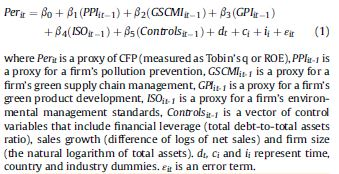

```{r setup, include=FALSE}
knitr::opts_chunk$set(echo = TRUE)
```

# Issues with panel datato considerate

> From [@Delmas2015] :Panel data include observations on N cross section units (i.e., firms) over T time-periods. As panel data analysis uses variation in both these dimensions, it is considered to be one of the most efficient analytical methods for data (Asteriou, 2006).

From...

> We address two commonly known issues that may contaminate the interpretation of results when applying statistical models to panel data. First, it is known that the panel dataset commonly used in accounting research produces incorrectly specified test statistics (e.g., overstated t-statistics) due to year-specific fixed effects that drive cross-sectional correlation and the firm fixed effects that drive the time-series correlation (Gow et al., 2010). Prior research commonly uses two statistical methodologies to circumvent these problems. First, prior studies use regressions with fixed effects at firm/industry and year levels to address the problem. Also, it has been shown that using a two-way clustering approach for robust standard errors clustered by firm/industry and year variables could help address these problems (Petersen, 2009 ). Our main results are calculated using regressions controlling for fixed effects of indus-tries and years. In ourrobustness tests, we apply two-way clustering regressions by firm and year and recalculate all regressions. Re-sults are qualitatively similar.
The second issue is related to the problem of endogeneity. Cost ofequity could be affected by business sustainability, but at the same time, sustainability performance measures and cost of equity could be jointly determined by other factors such as financial performance. One solution to such a problem involves using simultaneous equations like two-stage-least-square (2SLS) with instrumental variables or three-stage-least-square (3SLS). In order to address the problem of endogeneity, we follow Ferreira and Laux (2007) and use a lead lag regression design where business sustainability measures and control variables are pre-determined (at time t − 1). Since the dependent variableis costof equity attime t while theexplanatory variablesare lagged, the problem of endogeneity could be alleviated. Furthermore, we perform two-stage-least-square regressions to control for endogeneity and obtain qualitatively similar results (not reported) in Subsection 5.4.


#@MiroshnychenkoGreenpracticesfinancial2017

## Variables

**Dependent Variables:** Two indicators of corporate financial performance (CFP) :

1. Tobin's Q (Y1) 

2. ROE (Y2)


**Independent variables:** Four indicators of Corporate Environmental Performance (CEP) :

1. Internal Pollution Prevention index (X1)

2. Green Supply Chain Management Index (X2)

3. Green Product Index (X3)

4. ISO 14001 (X4)

**Control Variables:** 

1. Financial leverage (X5)

2. Sales Growth (x6)

3. Firm size (X7)

4. Country (X8)

5. Industry Sector (X9)

6. Year dummies 


##DataBase

The final sample includes 3490 publicly-traded firms from 58 countries and 19 industrial sectors covering the period from 2002 till 2014 inclusively


##Hypotheses

**H1:** Internal PP practices have a positive impact on CFP

**H2:** Green Supply Chain Management have a positive impact on CFP

**H3:** Green Product Development Practices have a positive impact on CFP

**H4:** ISO 14001 adoption has a positive impact on CFP

##Methodology




- **OLS estimators** has been adopted to estimate the main explanatory model. The authors estimate the OLS regression in micro panel using the **Huber-White sandwich estimators** to account for the heteroscedasticity problem (Long et Erwin 200)

- A series of **univariate tests** (i.e. Independent sample t-test with unequal variances and of Wilkinson rank-sum test) have been performed to compare whether the mean differences and median differences in green practices and in financial performance European Countries and the rest of the world are statistically significant

- **Correlation** for key variables had been measured. They calculated as well the **variance inflation factors** (VIF) of all the independent and control variables to test **the effects of multicollinearity** in the regression analysis.

- They performed 10 models of regression analyses. Model 1 and 2 was performed using both Tobin's q and ROE as CFP proxies and included only X1 and control variables. They did the same for X2, X3 et X4. Model 9 (Y1) and 10 (Y2) contained all variables, namely x1 --> x4 + control variables.

- In order to test the robustness of their model they also performed a **sensitivity analysis**. See paper for further details. 


##Results

1. H1, H2 and H3 were verified. Besides the major drivers of CFP at the firm level are internal green practices (PP and GSCM) while external green practices (GDP) play a secondary role in determining CFP.

2. The present study clearly reveals that green practices are related to company’s future market value, as well as future firm profitability, confirming the general theorization that CEP has a significant positive impact on CFP (Ambec and Lanoie, 2008).

3. Sales Growth is strongly and positively related to CFP in all the models

4. Leverage Ratio influence negatively CFP

5. Firm size is negatively associated with CFP and this effect is more pronounced for Tobin's Q than for ROE


#@JaspervanHuijgevoort2017

##Variables

**Dependent Variables:**

1. Tobin's Q simple as proxy of CFP (Y1) [^1]

[^1]: Perfect and Wiles (1994) describe five different estimators of Tobin’s q. According to @JaspervanHuijgevoort2017, in most empirical work the 'simple' methodology is used to estimate tobin's Q.

**Independent Variables:**

2. ESG score (x1)

3. E score (x2)

4. S score (x3)

5. G score (x4)

+ drivers of each subgroup (i.e. E,S and G)

**Control Variables:**

Sames as ones used in Derwall(2007) and Waddock and Graves(1997), namely :

1. firms size

2. ROA

3. Sales growth

4. R&D expenses


##Hypotheses

**H1:** ESG practices do increase the corporate financial performance of European small capitalization firms.

**H2:** Individual E, S and G factors of European small capitalization firms do increase the corporate financial performance.

**H3:** Environmental drivers behind the sub score corporate environmental performance do influence the corporate financial performance of European small capitalization in a positive way.

**H4:** H4: Social drivers behind the sub score corporate social performance do influence the corporate financial performance of European small capitalization in a positive way.

**H5:** Governance drivers behind the sub score corporate governance performance do influence the corporate financial performance of European small capitalization in a positive way.

**H6:** The size of a firm has a moderate role in the effect of ESG and corporate financial performance.

##DataBase

738 firm year observations of the STOXX Europe 200

##Methodology

* Panel data analyses using mutli-dimensional methodology 

* OLS estimators technique

* Hypothesizes are tested using both univariate and multivariate regression analyses

  + **H1** is tested with an univariate approach regressing X1 on Y1 including control variables
  
  + **H2** is tested with a multivariate regression analysis with each subgroup (i;e. E, S and G) as an independent variable
  
  + **H3,H4 and H5** are tested with a multivariate regression analysis with each drivers of each subgroup (i.e. E,S and G)
  
  + **H6** : To test the moderating effect of size on the ESG and corporate financial performance the sample is divided into three equally groups based on the size of a firm. For each of the three groups the first stage regressions is conducted. After these regressions the statistically significance of the differences between the groups will be determined. To determine the statistically significance of the differences the approach of Fairchild and MacKinnon (2009) is used. For the second and third group, dummy variables of firms size are multiplied with the corresponding ESG rating dummy variables. In order to determine the statistically significance of the differences all the dummy variables are used as explanatory variables in the model
  
* Wu-Hausman test to test the endogeneity bias

* Robustness analysis in using a different dependent variable. The author followed the methodology proposed by Dyck, Lins, Roth and Wagner (2016)

**Note to myself: I should check Dyck et al. 2016 to see if I could use the same methodo?**


* Correlation Matrix


**Note to mysefl: here the author does note take t+1 for Y1**


##Results

* H1, H6 is verified

* H2, H3, H5 is rejected

* H4 cannot be rejected neither affirmed as non significant


#@Delmas2015

##Variables

**Dependent Variables:** 

CFP indicators :

1. ROA (Y1)

2. Tobin's Q (Y2)

**Independent Variables:**

CEP indicators: 

1. Total greenhouse gas emissions (X1)

2. Water abstraction (X2)

3. General Waste (X3)

4. Volatile Organic compounds (X4)

5. Heavy metals (X5)

6. Natural resources (X6)

*Nb: Authors applied log transformations to all of the 6 IV to adjust for the skewed distribution.*


**Control Variables:**

1. KLD concerns (X7)

2. KLD strengths (X8)

3. Disclosure (X9)

4. Growth (X10)

5. Leverage (X11)

6. Capital Intensity (X12)

7. Firm size (X13)

*Nb: X10--> X13 is log*


##Hypotheses

**H1:** All else equals, the more a firm decreases GHG emissions the lower its short-term financial performance (i.e. ROA)

**H2:** All else equals, the more a firm decreases carbon emissions the more positive the investors' perceptions of future market performance (i.e. Tobin's Q)


##DataBase

1095 US firms corporations from 2004 to 2008

##Methodology

- Panel data analyses with fixed effect model (i.e. Hausman test rejected the random effects model in favor of the fixed effects model for both Y1 and Y2)

- Statistics descriptive (mean sd, min, max + variable description) see table 1 and table 3 (by industry sector) **Note to myself: it could be interesting to take the same layout than table 1 for my thesis**

- Matrix of correlation

- They made 2 models for their fixed effect Regression Analysis (i.e. one for each dependent variable). Both dependent variables are t+1.

> The observations in Xit are lagged 1 year behind the dependent variables. By lagging the independent variables 1 year behind financial performance, we further increase our confidence in the direction of the relationship.

**Note to myself: Should I also take Y in t+1? Or I do both, namely one or I consider financial data for 2012,2013 and 2014 (t) and an other one where I consider financial data for 2013,2014 and 2015 (t+1)??? Maybe it could show that financial performance is better in t+1 than t? Long term performance?**

**Note to myself: I could make a mix between the methodology of dalmas et al2015 and the one of Miroshnychenko2017, namely in my case it will be 6 models: model 1; Regress only green performance variables ( + cv's) on CFP ROA, model 2; Regress only green performance variables ( + cv's) on CFP Tobin's Q, model 3; Regress only green initiatives variables ( + cv's) on CFP ROA, model 4; regress only green initiatives variables ( + cv's) on CFP tobin's q, model 5; Regress all variables ( + cv's) on CFP ROA and finaly model 6; regress all variables ( + cv's) on CFP Tobin's Q.** 


##Results

- Investing in proactive environmental strategies might be costly in the short term, yet profitable in the long term

- Both hypotheses verified

- Firm size : negative impact (significant) 

- Growth : positive impact (significant)

#References

